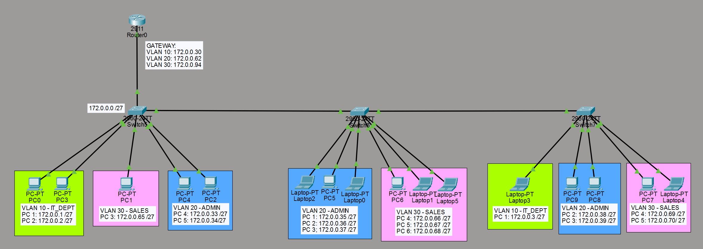

# Router-on-a-Stick Inter-VLAN Routing

## Objective

Route between three VLANs spread across a chain of access switches, using a single router interface with subinterfaces (Router-on-a-Stick), rather than a Layer 3 switch with SVIs.

## Topology



- **Router0** (Cisco 2911) — single trunk link down to Switch5, no routing done anywhere else
- **Switch5 → Switch6 → Switch7** — three 2960-24TT access switches daisy-chained by trunk links, carrying all three VLANs end-to-end
- 3 VLANs, each its own /27, spread across all three switches:

  | VLAN | Name | Subnet | Gateway (router subinterface) |
  |---|---|---|---|
  | 10 | IT_DEPT | 172.0.0.0/27 | 172.0.0.30 |
  | 20 | ADMIN | 172.0.0.32/27 | 172.0.0.62 |
  | 30 | SALES | 172.0.0.64/27 | 172.0.0.94 |

- Devices per switch:
  - **Switch5:** PC0, PC3 (VLAN 10) · PC1 (VLAN 30) · PC4, PC2 (VLAN 20)
  - **Switch6:** Laptop2, PC5, Laptop0 (VLAN 20) · PC6, Laptop1, Laptop5 (VLAN 30)
  - **Switch7:** Laptop3 (VLAN 10) · PC9, PC8 (VLAN 20) · PC7, Laptop4 (VLAN 30)

## What I configured

**Router (ROAS)**
- One physical interface (Gi0/0), three subinterfaces — one per VLAN
- 802.1Q encapsulation with the matching VLAN tag on each subinterface
- Each subinterface holds the gateway IP for its VLAN's /27

**Switches**
- VLAN database (10/20/30) configured identically on all three switches so trunking works end-to-end
- Trunk links: Switch5↔Router0, Switch5↔Switch6, Switch6↔Switch7 — carrying all VLANs down the chain
- Access ports assigned to the correct VLAN per device, spread across all three switches rather than one VLAN per switch — meaning every switch has to trunk all three VLANs even though its own hosts might only use one or two

## Key commands used

```
! Router side
interface gi0/0.10
 encapsulation dot1Q 10
 ip address 172.0.0.30 255.255.255.224

! Switch side
vlan 10
 name IT_DEPT

interface fa0/1
 switchport trunk encapsulation dot1q
 switchport mode trunk

interface fa0/3
 switchport mode access
 switchport access vlan 10
```

## Verification

```
show ip interface brief
show interfaces trunk
show vlan brief
show ip route
```
(from PCs) `ipconfig` to confirm gateway, then `ping` across VLANs to confirm routing works through Router0.

## What I learned / issues hit

- Since VLANs aren't confined to one switch each, every trunk in the chain has to carry all three VLANs — a single missed `switchport trunk` on any hop breaks connectivity for whichever VLAN's hosts sit past that point.
- ROAS puts all inter-VLAN traffic through one physical link to the router — noticeably different from the SVI-based lab, where routing happens right at the multilayer switch. Good side-by-side comparison of when each design makes sense (ROAS: cheap, no L3 switch needed; SVI: scales better, no router bottleneck).
- Subnetting each VLAN into its own /27 (rather than one shared block) meant every switch just needed the VLAN tag right — the addressing itself didn't change per switch, since a VLAN's subnet is the same no matter which physical switch a member sits on.

## Configs

See [`/configs`](./Configs) for the reconstructed device configurations (Router0, Switch5, Switch6, Switch7).
